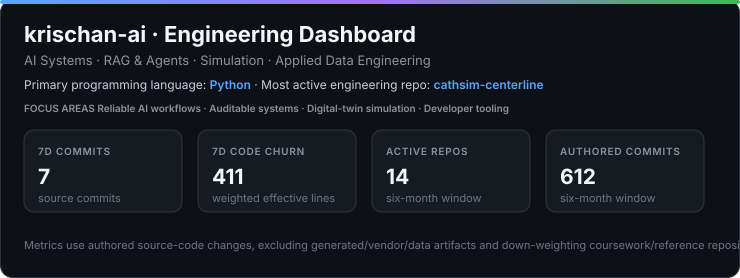
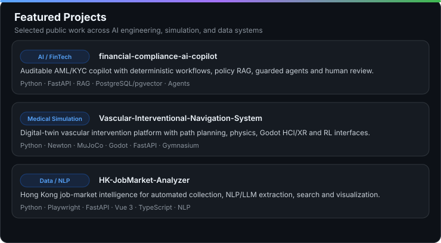
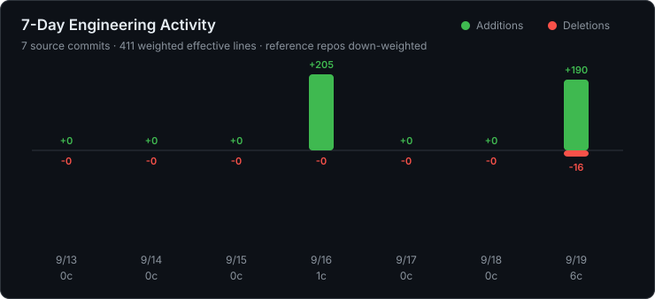
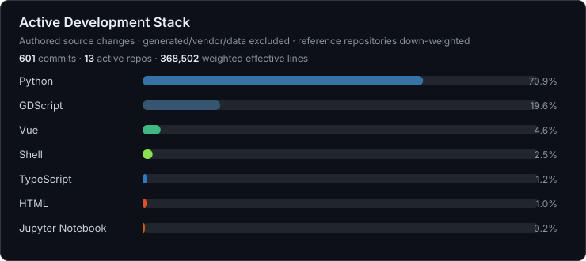
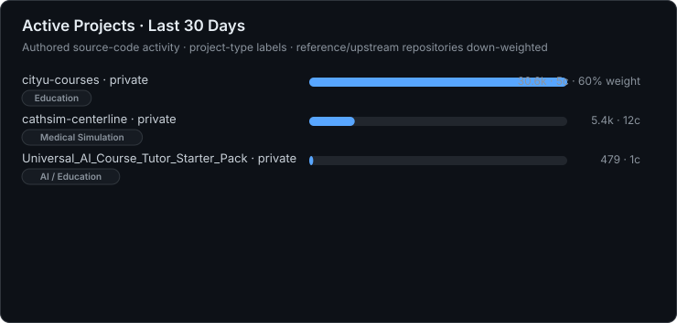

# krischan-ai

AI Systems · RAG & Agents · Simulation · Applied Data Engineering

## Featured Projects

- [Financial Compliance & Transaction Risk AI Copilot](https://github.com/krischan-ai/financial-compliance-ai-copilot) — auditable AML/KYC review workflows, policy RAG, guarded agent assistance, human review, traceability and regression-tested backend engineering.
- [Vascular Interventional Navigation System](https://github.com/krischan-ai/Vascular-Interventional-Navigation-System) — digital-twin vascular intervention research platform spanning path planning, Newton/MuJoCo physics, Godot HCI/XR, FastAPI and reinforcement-learning interfaces.
- [HK Job Market Analyzer](https://github.com/krischan-ai/HK-JobMarket-Analyzer) — automated Hong Kong job-market collection and intelligence with data cleaning, NLP/LLM extraction, knowledge-base search, FastAPI and Vue 3 visualization.

## Recent Engineering Activity

## Active Development Stack

## Active Projects

### How these metrics work

These cards measure authored source-code changes instead of total repository size. Generated files, datasets, vendor/build outputs, and other non-source artifacts are excluded. Large single-file changes are capped to reduce distortion from bulk-generated content.

Repositories are also classified by project type. Original engineering projects use full weight, while learning, reference, upstream-derived, and dataset repositories are down-weighted so they do not dominate the dashboard simply because they contain large imported codebases. The rules are explicit and auditable in [`repository-rules.json`](./repository-rules.json).

Featured project metadata is maintained separately in [`featured-projects.json`](./featured-projects.json), so the portfolio layer stays explicit and easy to update without changing the metric logic.
